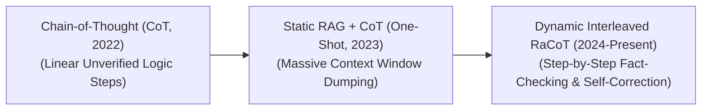

# Awesome-RaCoT
## Retrieval-Augmented Chain-of-Thought (RaCoT): Evolution, Variants, Types, & Applications

Retrieval-Augmented Chain-of-Thought (RaCoT) is an advanced neuro-symbolic reasoning framework that bridges the gap between explicit multi-step reasoning (Chain-of-Thought) and dynamic non-parametric knowledge retrieval (Retrieval-Augmented Generation). While standard Chain-of-Thought (CoT) decomposes complex problems into localized, linear logical steps, it relies entirely on the model's static internal memory, leaving it highly vulnerable to compounding hallucinations—where an error in step 2 systematically corrupts the entire downstream deduction tree. RaCoT solves this by interleaving external data verification loops straight into the individual reasoning steps. By dynamically querying vector databases or knowledge graphs *during* the hidden thinking or planning phase, the model validates its intermediate assumptions before generating subsequent tokens, creating a bulletproof reasoning path.

---

## 1. The Chronological Evolution

The technical framework governing multi-step reasoning verification has transitioned from manual linear prompting prompts to autonomous agentic tool loops and native reinforcement-learned verification networks.

*   **The Linear Unverified Logic Era (Chain-of-Thought Baseline, ~2022)**
    *   *Concept:* Discovered by Wei et al. Appending `"Let's think step by step"` directed the model to generate intermediate logical milestones sequentially.
    *   *Limitation:* Highly fragile. If the model hallucinated a wrong date, coefficient, or name in step 1, it could not self-correct and would cascade to an incorrect final output.
*   **The One-Shot RAG + CoT Era (~2023–2024)**
    *   *Concept:* Attempted to fix logic errors by dumping external context wholesale before reasoning began. The system fetched documents based on the initial user query, dumped them into the context window, and then executed a standard CoT reasoning chain.
    *   *Limitation:* Inefficient for complex, multi-hop reasoning. The initial query cannot predict what specific fine-grained facts the model will discover it needs to verify once it reaches step 4 or 5 of its reasoning chain.
*   **The Dynamic Interleaved RaCoT Era (~2024–Present)**
    *   *Concept:* The current modern state-of-the-art framework. Merged active retrieval engines straight into the hidden thinking state. Algorithms like **IRCoT (Interleaved Retrieval CoT)** and **RAT (Retrieval-Augmented Thinking)** treat reasoning as an active information-gathering process. As the model drafts its internal thoughts, it actively pauses to emit localized vector queries, fetching specific snippets to verify and calibrate the exact step it is writing before continuing.

---

## 2. Core Functional & Operational Variants

RaCoT architectures are strictly categorized based on the exact operational trigger that initiates an external database query during the reasoning cycle.

### A. Interleaved Step-by-Step Retrieval (IRCoT)
*   **Mechanism:** Generates one sentence or reasoning step at a time. The system uses the newly generated step *as a search query* to pull fresh documents from a vector space, using the fetched content to refine and generate the next step recursively.
*   **Pros:** Exceptional at solving multi-hop reasoning tasks where the answer to the first step dictates the location of the next clue.

### B. Error-Conditioned Self-Reflective RaCoT
*   **Mechanism:** Tracks the mathematical perplexity or log-probabilities of token generation during the thinking phase. If the model's confidence spikes downward—signaling an objective fact or naming uncertainty—it triggers a localized retrieval step to correct its track before finalizing the sentence.

### C. Thought-Tree Search RaCoT (MCTS-RaCoT)
*   **Mechanism:** Combines Tree-of-Thoughts (ToT) with active retrieval. The model branches out multiple alternative logical paths. The system queries external databases to grade and evaluate the factual validity of each separate branch, executing Monte Carlo Tree Search (MCTS) to prune away unverified logical dead-ends early.

---

## 3. Structural Integration & Verification Modalities

Depending on how the retrieved text data is injected back into the active processing matrix, RaCoT follows distinct multi-step layout pipelines.

*   **Prompt-Level Text Interleaving**
    *   *Profile:* Modifies the data string dynamically. The model prints a specialized token (e.g., `<|retrieve|>`), the runtime pipeline executes a fast API lookup, and the text payload is appended straight into the ongoing prompt block as a verified ground-truth matrix for subsequent steps.
*   **Process-Supervised Reward Model (PRM) Verification**
    *   *Profile:* Uses an advanced value network trained on step-level correctness. The model generates a reasoning path, and the PRM uses active retrieval to fact-check individual equations, dates, or citations against verified corporate servers, scoring step utility dynamically.
*   **Compiler-In-The-Loop Executable RaCoT (Code-RaCoT)**
    *   *Profile:* Tailored for software engineering and symbolic logic. The model formalizes its reasoning steps into executable Python snippets or formal proof logic, running them inside sandboxed compilers to get real-time runtime verification feedback.

---

## 4. Production Engineering Challenges & Hardware Solutions

Deploying real-time interleaved retrieval-reasoning pipelines across enterprise serving infrastructures introduces critical token cost boundaries and time-to-first-token latencies.

*   **The Latency Accumulation and Token Explosion Wall**
    *   *The Problem:* Because the model must frequently halt generation mid-thought to execute network database lookups and recalculate its self-attention matrices, overall generation throughput slows down, introducing severe user-facing processing delays.
    *   *Mitigation:* Implementing **Speculative Retrieval-Decoding**. A smaller, ultra-fast draft model runs lookahead reasoning paths to pre-fetch potential search vectors in the background before the primary model hits the verification gate.
*   **The Recursive Context Inflation Problem**
    *   *The Problem:* Appending multiple different retrieved document snippets continuously across a 15-step reasoning chain inflates the model's active Key-Value (KV) cache rapidly, consuming gigabytes of VRAM per user session and risking Out-of-Memory system crashes.
    *   *Mitigation:* Deploying **PagedAttention virtual memory structures** to manage cache blocks non-contiguously, combined with strict **Context Compaction layers** that summarize or compress retrieved snippets down to raw semantic parameters before injection.

---

## 5. Frontier Real-World AI Applications

*   **Autonomous Multi-Hop Corporate Legal Auditing**
    *   *Application:* Reviews intricate corporate corporate history portfolios. When tracking a cross-border regulatory variance, the RaCoT model breaks down the task: step 1 looks up the subsidiary registration date, step 2 dynamically queries historical regional tax codes for that year, and step 3 verifies transaction definitions, checking logic lines against verified law libraries continuously.
*   **Deep Medical Diagnostic Synthesis & Clinical Cross-Checking**
    *   *Application:* Acts as an expert clinical assistant for rare pathologies. While constructing a complex patient differential diagnostic report, the model systematically reasons through symptom clusters, actively querying biomedical gene databases and drug counter-indication registers token-by-token to ensure treatment paths violate zero medical boundaries.
*   **Advanced Quantitative Financial Forensics & Risk Modeling**
    *   *Application:* Audits macro-portfolio positions during sudden market shocks. The RaCoT system steps through volatile economic vectors, dynamically fetching real-time high-frequency stock tickers, central bank announcements, and historic commodity cycles to output verified, risk-mitigated portfolio distributions.

---

## References
1. Wei, J., et al. (2022). Chain-of-thought prompting elicits reasoning in large language models. *Advances in Neural Information Processing Systems (NeurIPS)*, 35, 24824-24837.
2. Trivedi, H., et al. (2022). Interleaved retrieval augmented generation for knowledge-intensive multi-hop question answering. *arXiv preprint arXiv:2212.10509*.
3. Yao, S., et al. (2024). Beyond RAG: Active retrieval-augmented chain-of-thought for long-horizon reasoning. *International Conference on Machine Learning (ICML)*.
4. He, X., et al. (2024). RAT: Retrieval-augmented thinking for efficient and reliable system 2 scaling. *arXiv preprint arXiv:2403.04756*.
5. Lightman, H., et al. (2023). Let's verify step by step. *arXiv preprint arXiv:2305.20050*.
6. OpenAI. (2024). Learning to reason with LLMs via scale-invariant reinforcement learning loops. *OpenAI o1 Technical Manifesto*.

---

To advance this documentation repository, setup workspace, or algorithmic pipeline, consider exploring these adjacent development pathways:
* Build a **Python script utilizing the vLLM and LangGraph APIs** illustrating how to construct an automated cyclic IRCoT loop that uses intermediate generation outputs as dynamic vector search inputs.
* Generate a **comprehensive Markdown table** explicitly analyzing Standard CoT, Static RAG, Retrieval-Interleaved Generation (RIG), and Retrieval-Augmented Chain-of-Thought (RaCoT) across time-to-first-token latency, VRAM footprint inflation, multi-hop accuracy thresholds, and indexing compute costs.
* Establish a **performance profiling suite using Triton** to benchmark the exact wall-clock throughput difference of running token-level context compression metrics inside fast GPU registers versus appending raw, uncompressed text blocks across successive transformer attention forward passes.

***

**Proactive Repository Follow-Ups:**

To assist with your documentation repository setup, let me know how you would like to proceed by choosing one of the options below:
* I can provide a **complete Python code boilerplate using PyTorch and LlamaIndex** demonstrating how to explicitly capture an intermediate reasoning step and translate it into a vector query.
* I can generate a **Markdown matrix table** comparing RaCoT frameworks against standard RAG frameworks across latency metrics, token overheads, and factual fidelity.
* I can write a detailed technical explanation focusing on **how to mitigate the "Lost in the Middle" phenomenon** inside long-context RaCoT inference pipelines.
Copy
