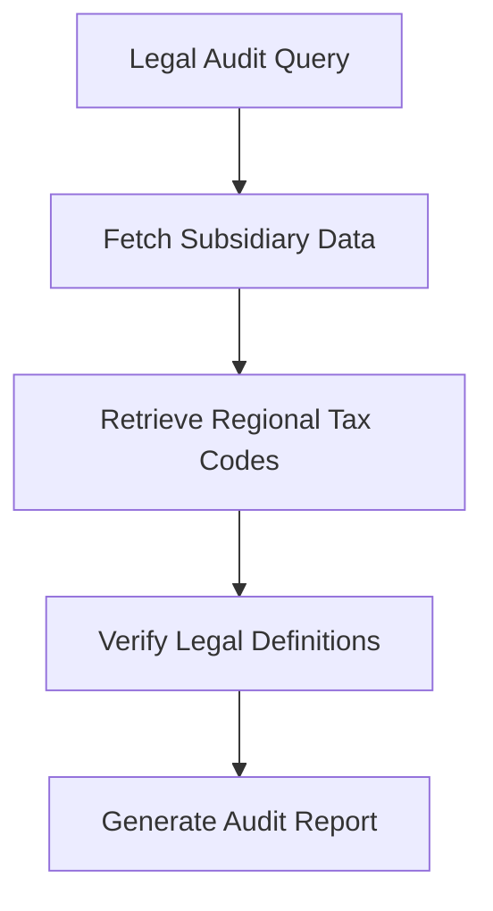

# Autonomous Multi-Hop Corporate Legal Auditing

## Overview
Applies RaCoT to verify regulatory compliance, stepping through complex corporate histories, tax codes, and auditing libraries.

## Architectural Diagram

## Detailed Explanation
This documentation page provides deeper insights into **Autonomous Multi-Hop Corporate Legal Auditing** under the Retrieval-Augmented Chain-of-Thought (RaCoT) framework. By integrating external reference verification loops directly into active generation cycles, this methodology reduces error rates and stabilizes multi-step reasoning capabilities.

---
[Back to main README](../README.md)
