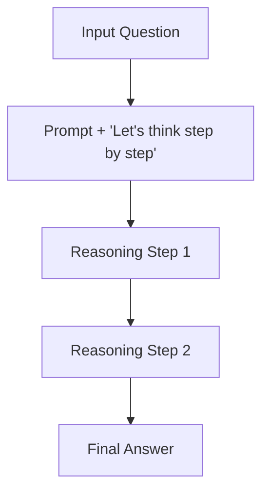

# Chain-of-Thought (CoT) Baseline

## Overview
Chain-of-Thought (CoT) baseline prompting directs the model to emit a sequence of intermediate reasoning steps to solve complex multi-hop or mathematical tasks.

## Architectural Diagram

## Detailed Explanation
This documentation page provides deeper insights into **Chain-of-Thought (CoT) Baseline** under the Retrieval-Augmented Chain-of-Thought (RaCoT) framework. By integrating external reference verification loops directly into active generation cycles, this methodology reduces error rates and stabilizes multi-step reasoning capabilities.

---
[Back to main README](../README.md)
