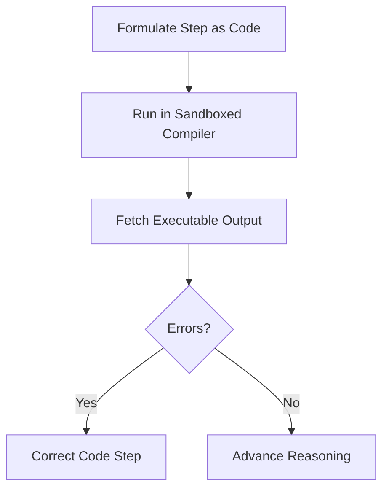

# Compiler-In-The-Loop Executable RaCoT (Code-RaCoT)

## Overview
Code-RaCoT translates reasoning into executable code (e.g., Python), running snippets inside a sandboxed compiler for instant verification.

## Architectural Diagram

## Detailed Explanation
This documentation page provides deeper insights into **Compiler-In-The-Loop Executable RaCoT (Code-RaCoT)** under the Retrieval-Augmented Chain-of-Thought (RaCoT) framework. By integrating external reference verification loops directly into active generation cycles, this methodology reduces error rates and stabilizes multi-step reasoning capabilities.

---
[Back to main README](../README.md)
