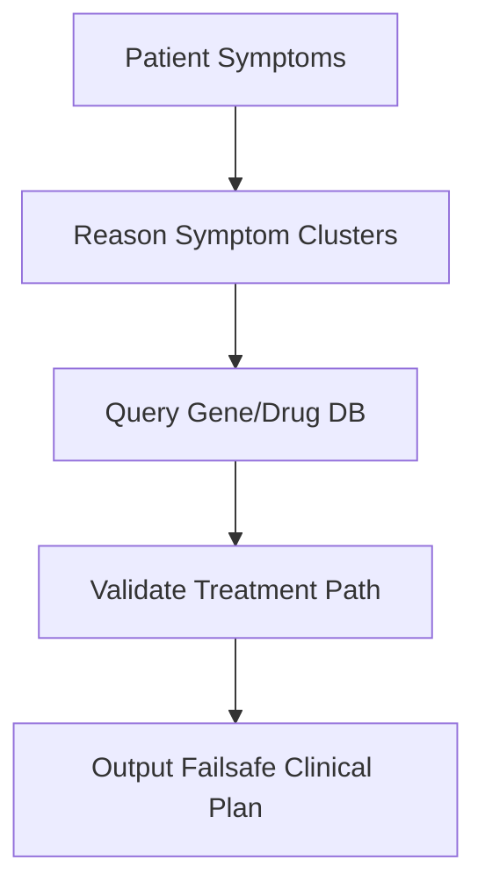

# Deep Medical Diagnostic Synthesis & Clinical Cross-Checking

## Overview
Enables clinical assistants to verify symptoms against drug registers and biomedical gene databases token-by-token.

## Architectural Diagram

## Detailed Explanation
This documentation page provides deeper insights into **Deep Medical Diagnostic Synthesis & Clinical Cross-Checking** under the Retrieval-Augmented Chain-of-Thought (RaCoT) framework. By integrating external reference verification loops directly into active generation cycles, this methodology reduces error rates and stabilizes multi-step reasoning capabilities.

---
[Back to main README](../README.md)
