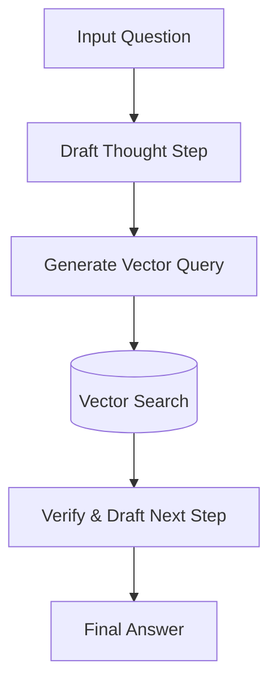

# Dynamic Interleaved RaCoT Era

## Overview
Dynamic Interleaved RaCoT merges active retrieval engines into the reasoning cycle, pausing to fetch specific snippets to verify intermediate thoughts.

## Architectural Diagram

## Detailed Explanation
This documentation page provides deeper insights into **Dynamic Interleaved RaCoT Era** under the Retrieval-Augmented Chain-of-Thought (RaCoT) framework. By integrating external reference verification loops directly into active generation cycles, this methodology reduces error rates and stabilizes multi-step reasoning capabilities.

---
[Back to main README](../README.md)
