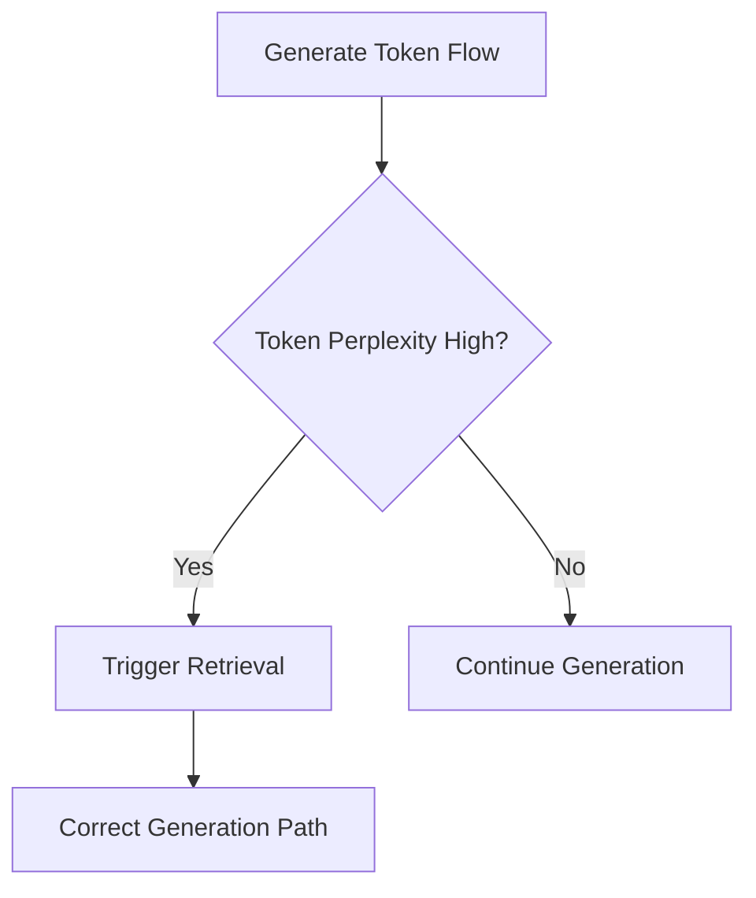

# Error-Conditioned Self-Reflective RaCoT

## Overview
This variant tracks token generation confidence/perplexity. Downward spikes in confidence trigger retrieval steps to resolve factual ambiguities.

## Architectural Diagram

## Detailed Explanation
This documentation page provides deeper insights into **Error-Conditioned Self-Reflective RaCoT** under the Retrieval-Augmented Chain-of-Thought (RaCoT) framework. By integrating external reference verification loops directly into active generation cycles, this methodology reduces error rates and stabilizes multi-step reasoning capabilities.

---
[Back to main README](../README.md)
