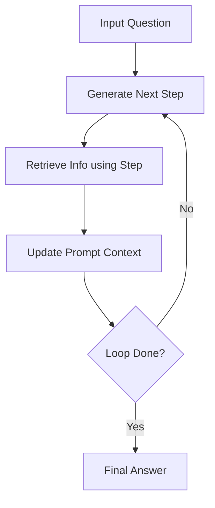

# Interleaved Step-by-Step Retrieval (IRCoT)

## Overview
IRCoT generates one step at a time, using the newly generated sentence as a search query to pull fresh documents recursively.

## Architectural Diagram

## Detailed Explanation
This documentation page provides deeper insights into **Interleaved Step-by-Step Retrieval (IRCoT)** under the Retrieval-Augmented Chain-of-Thought (RaCoT) framework. By integrating external reference verification loops directly into active generation cycles, this methodology reduces error rates and stabilizes multi-step reasoning capabilities.

---
[Back to main README](../README.md)
