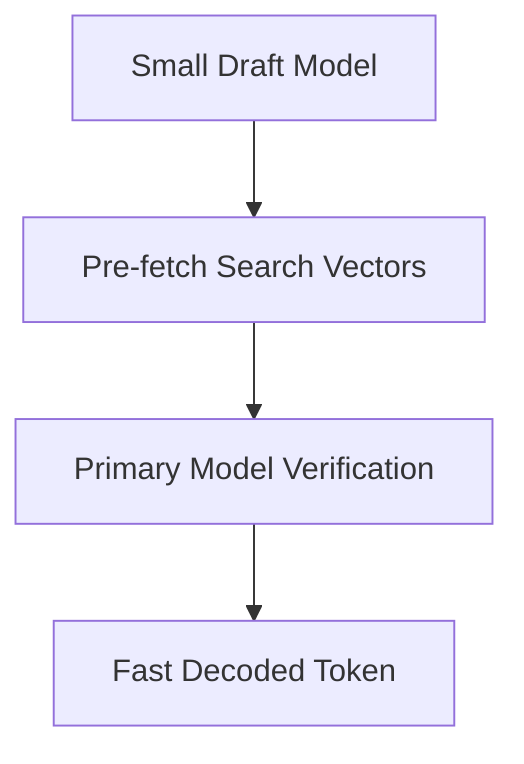

# The Latency Accumulation and Token Explosion Wall

## Overview
Interleaved RAG introduces heavy latency. Speculative Retrieval-Decoding mitigates this by using smaller models to pre-fetch search vectors.

## Architectural Diagram

## Detailed Explanation
This documentation page provides deeper insights into **The Latency Accumulation and Token Explosion Wall** under the Retrieval-Augmented Chain-of-Thought (RaCoT) framework. By integrating external reference verification loops directly into active generation cycles, this methodology reduces error rates and stabilizes multi-step reasoning capabilities.

---
[Back to main README](../README.md)
