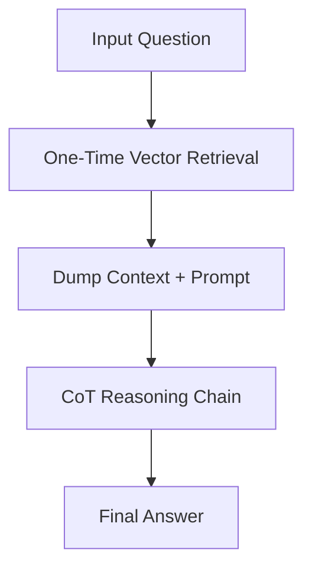

# One-Shot RAG + CoT Era

## Overview
One-Shot RAG dumps external context wholesale before reasoning begins. The system retrieves documents based on the initial query and appends them to the context window.

## Architectural Diagram

## Detailed Explanation
This documentation page provides deeper insights into **One-Shot RAG + CoT Era** under the Retrieval-Augmented Chain-of-Thought (RaCoT) framework. By integrating external reference verification loops directly into active generation cycles, this methodology reduces error rates and stabilizes multi-step reasoning capabilities.

---
[Back to main README](../README.md)
