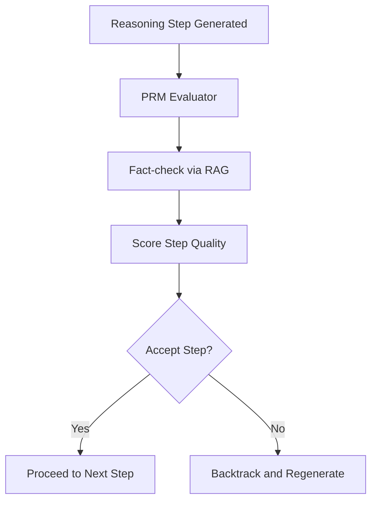

# Process-Supervised Reward Model (PRM) Verification

## Overview
Uses a value network to score the correctness of individual reasoning steps, verifying factual claims against knowledge sources.

## Architectural Diagram

## Detailed Explanation
This documentation page provides deeper insights into **Process-Supervised Reward Model (PRM) Verification** under the Retrieval-Augmented Chain-of-Thought (RaCoT) framework. By integrating external reference verification loops directly into active generation cycles, this methodology reduces error rates and stabilizes multi-step reasoning capabilities.

---
[Back to main README](../README.md)
