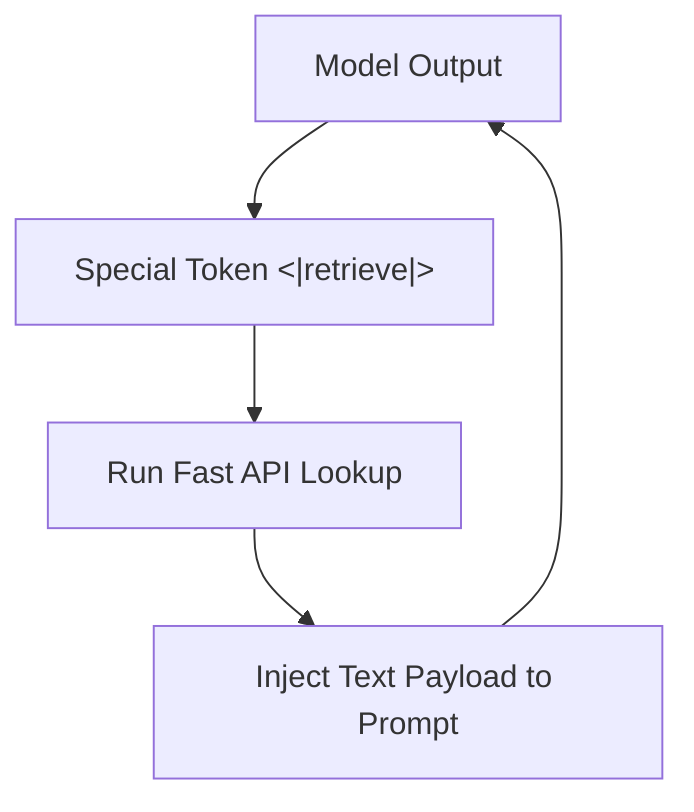

# Prompt-Level Text Interleaving

## Overview
A structural layout format where a model emits special tokens to execute dynamic lookup APIs, directly stitching retrieved data back into the prompt stream.

## Architectural Diagram

## Detailed Explanation
This documentation page provides deeper insights into **Prompt-Level Text Interleaving** under the Retrieval-Augmented Chain-of-Thought (RaCoT) framework. By integrating external reference verification loops directly into active generation cycles, this methodology reduces error rates and stabilizes multi-step reasoning capabilities.

---
[Back to main README](../README.md)
