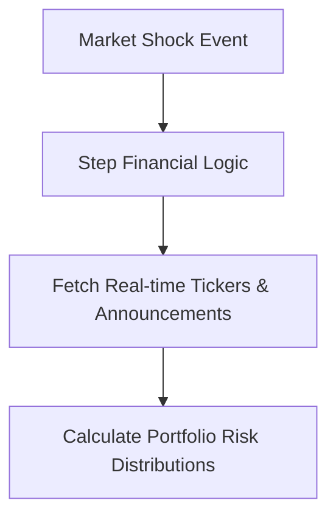

# Advanced Quantitative Financial Forensics & Risk Modeling

## Overview
Audits macro positions during sudden shocks, fetching commodity cycles and central bank announcements to balance risk.

## Architectural Diagram

## Detailed Explanation
This documentation page provides deeper insights into **Advanced Quantitative Financial Forensics & Risk Modeling** under the Retrieval-Augmented Chain-of-Thought (RaCoT) framework. By integrating external reference verification loops directly into active generation cycles, this methodology reduces error rates and stabilizes multi-step reasoning capabilities.

---
[Back to main README](../README.md)
