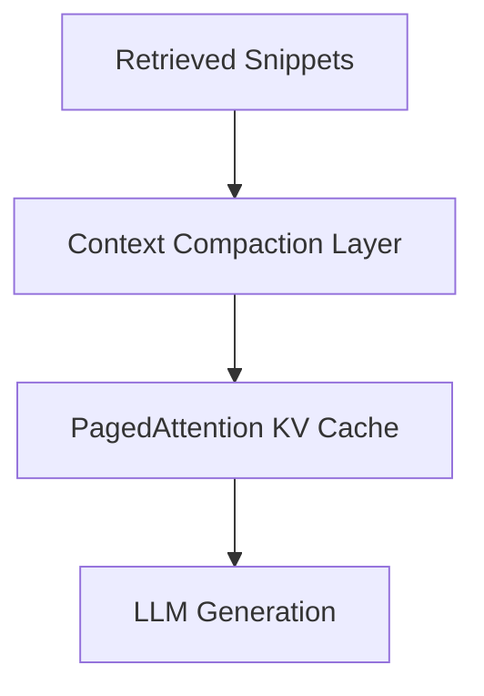

# The Recursive Context Inflation Problem

## Overview
Multi-step context injection inflates the KV cache. Virtual memory management (PagedAttention) and context compaction compress these tokens.

## Architectural Diagram

## Detailed Explanation
This documentation page provides deeper insights into **The Recursive Context Inflation Problem** under the Retrieval-Augmented Chain-of-Thought (RaCoT) framework. By integrating external reference verification loops directly into active generation cycles, this methodology reduces error rates and stabilizes multi-step reasoning capabilities.

---
[Back to main README](../README.md)
