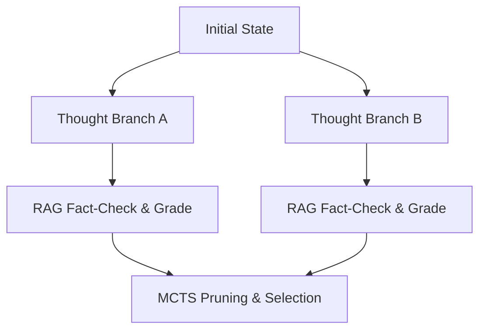

# Thought-Tree Search RaCoT (MCTS-RaCoT)

## Overview
Thought-Tree Search combines Tree-of-Thoughts with active retrieval, scoring factuality of branches using MCTS to prune invalid paths.

## Architectural Diagram

## Detailed Explanation
This documentation page provides deeper insights into **Thought-Tree Search RaCoT (MCTS-RaCoT)** under the Retrieval-Augmented Chain-of-Thought (RaCoT) framework. By integrating external reference verification loops directly into active generation cycles, this methodology reduces error rates and stabilizes multi-step reasoning capabilities.

---
[Back to main README](../README.md)
